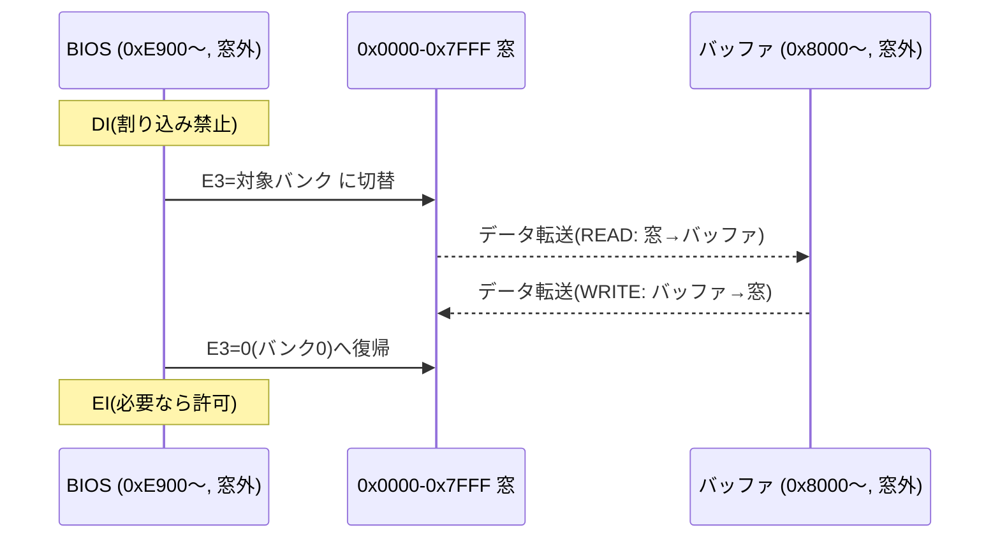

# メモリマップ詳細設計

関連issue: #4 / 親 #3
参照: `doc/概要検討/概要検討.md`、`doc/設計/08_CPM取得ビルド.md`

## 1. 目的

PC-8001無印 + PC8001-MEM 上で CP/M 2.2 を動かすための **メモリ配置を確定**する。
CCP/BDOS/BIOS/TPA の配置アドレス、ゼロページ、テキストVRAMとの境界、
PC8001-MEM のバンク運用を定義する。本設計が #5(ブート)/#6(BIOS)/#8(ディスク)/
#11(CP/Mビルド)の前提となる。

## 2. ハードウェア前提(確定事項)

| 項目 | 値 | 出典 |
|------|----|------|
| N-BASIC ROM | 0x0000〜(24KB) | 概要検討 |
| 本体RAM | 上位側に実装(16/32KB) | 概要検討 |
| テキストVRAM(N-BASIC時) | **0xF300〜0xFEB7**(固定値) | ENRI資料 |
| PC8001-MEM 切替対象 | **0x0000〜0x7FFF(32KB窓)** | PC8001-MEM |
| PC8001-MEM 容量 | 128KB(32KB×4バンク) | PC8001-MEM |
| E2 bit0 | 読出選択 0=ROM / 1=拡張RAM | PC8001-MEM |
| E2 bit4 | 拡張RAM 書込許可(読出選択と独立) | PC8001-MEM |
| E3 | バンク選択(リセット時バンク0) | PC8001-MEM |

## 3. 64KB アドレス空間の供給

CP/M はゼロページからメモリ上端まで連続した 64KB を前提とする。本構成では
**下位32KBを PC8001-MEM(バンク窓)、上位を本体RAM** で供給する。

| アドレス範囲 | 供給元 | 用途 |
|--------------|--------|------|
| 0x0000〜0x7FFF | PC8001-MEM(バンク0・RAM) | ゼロページ + TPA 前半 |
| 0x8000〜0xF2FF | 本体RAM | TPA 後半 + CCP/BDOS/BIOS |
| 0xF300〜0xFEB7 | 本体RAM(テキストVRAM) | 画面表示(CP/Mシステムは置けない) |
| 0xFEB8〜0xFFFF | 本体RAM | 余白(ワーク等) |

**CP/Mシステム領域(CCP/BDOS/BIOS)の上端は VRAM 下端 0xF300 より下**に置く。
したがって CP/M の実効メモリ上端は **0xF2FF**。

## 4. 確定メモリマップ

BIOS サイズを **0xA00(2560バイト)** と予算化し、上端を 0xF2FF に合わせて確定する。
CCP=0x800・BDOS=0xE00 は固定。

| 領域 | 範囲 | サイズ | 備考 |
|------|------|--------|------|
| ゼロページ | 0x0000〜0x00FF | 0x100 | CP/M規約領域(下記詳細) |
| TPA | 0x0100〜0xD2FF | 0xD200(約52.7KB) | ユーザプログラム領域 |
| CCP | 0xD300〜0xDAFF | 0x800 | `CCP_ORG = 0D300h` |
| BDOS | 0xDB00〜0xE8FF | 0xE00 | `BDOS_ORG = 0DB00h`、エントリは 0xDB06 |
| BIOS | 0xE900〜0xF2FF | 0xA00(予算) | `BIOS_ORG = 0E900h`、新規作成(#6) |
| (VRAM) | 0xF300〜0xFEB7 | — | システム領域外 |

導出関係: `BDOS_ORG = CCP_ORG + 0x800`、`BIOS_ORG = BDOS_ORG + 0xE00`。
物理RAMは0xFFFFまで存在するが、0xF300〜はVRAM/余白に占有されるため、**CP/Mとしての論理上端は0xF2FF**。

### ゼロページ詳細(CP/M 2.2規約)

| アドレス | 内容 | 本構成での値 |
|----------|------|-------------|
| 0x0000〜0x0002 | `JP WBOOT`(ウォームブート) | `JP 0E903h` |
| 0x0003 | IOBYTE | — |
| 0x0004 | 現在ドライブ/ユーザ番号 | — |
| 0x0005〜0x0007 | `JP BDOS`(BDOSエントリ) | `JP 0DB06h` |
| 0x0008〜0x0037 | RST 1〜6 ベクタ | (割り込み方針は #10) |
| 0x0038〜0x003A | RST7 ベクタ | (#10。PC-8001のVRTC割込と競合注意) |
| 0x005C〜0x007C | デフォルトFCB | — |
| 0x0080〜0x00FF | **デフォルトDMAバッファ(128B)** | バンク窓(<0x8000)内 ← S参照 |

- **WBOOTベクタ**: BIOSジャンプテーブル先頭は BOOT(=`BIOS_ORG`=0xE900)、2番目が WBOOT(=`BIOS_ORG+3`=**0xE903**)。よって 0x0000 は `JP 0E903h`。
- **BDOSエントリの+6**: BDOS先頭6バイトはシリアル番号等のヘッダで、実エントリは `BDOS_ORG+6`(0xDB06)。アプリは 0x0006〜0x0007 を読んでTPA上端を知る(`LHLD 0006h`)。BIOSサイズ変動で上端は可変。
- **デフォルトDMA 0x0080 はバンク窓内**である点が重要(§5 のバンク切替制約に直結)。

> BIOS 予算 0xA00 は SDドライバ + 端末エミュレーション + ディスク制御ロジックを見込んだ暫定。
> **512Bデブロッキングバッファ等の大きなワークは BIOS領域(0xE900〜)に含めず、
> 0x8000台の本体RAMワーク領域に置く**(予算逼迫の回避。配置詳細は #6/#8)。
> #6 で実サイズが確定したら、超過/余剰に応じて CCP_ORG 以降を再調整する(全体が連動)。
> #11 の `make cpm` 既定値(現状44K例)は本値 `CCP_ORG=0D300h / BDOS_ORG=0DB00h` に更新する
> (#11 と本PRのマージ後に反映)。

## 5. PC8001-MEM バンク運用

| バンク | 用途(設計方針) |
|--------|----------------|
| バンク0 | **CP/M 実行域**(0x0000〜0x7FFF をRAMとして常用) |
| バンク1〜3 | RAMディスク、ウォームブート用 CCP/BDOS 原本保持(#10)等 |

PC8001-MEM の状態遷移:
- **リセット直後**: E2 bit0=0(ROM可視)、E3=バンク0。ブートで bit0 を 1 へ遷移(#5)。
- **CP/M通常動作中**: E2 bit0=1(0x0000〜を拡張RAM読出)、E2 bit4=1(書込許可)、E3=バンク0。

### バンク切替時の重要な制約

切替対象は 0x0000〜0x7FFF。**この窓には TPA 前半が乗る**ため、RAMディスク等で
バンクを切り替えると TPA 前半が一時的に見えなくなる。したがってバンク切替は:

- 切替を行うコード(BIOS)と、転送バッファは **0x8000 以上(窓外)** に置く。
- 切替中は割り込みを禁止する(#10)。
- 「バンク切替 → 窓越しにデータ転送 → バンク0へ復帰」を不可分に行う。
- **BDOSが渡すDMAアドレスが窓内(<0x8000、特にデフォルトDMA 0x0080)の場合**、
  バンク切替中はその領域自体が化けるため、一旦**窓外バッファ経由で転送し、
  バンク0復帰後に窓内DMAアドレスへコピー**する(#8 のREAD/WRITEで考慮)。

## 6. 未確定・後続への申し送り

| 項目 | 後続 |
|------|------|
| BIOS 実サイズ確定 → 予算 0xA00 の見直し、CCP_ORG 等の再調整 | #6 |
| ゼロページの RST7(0x0038)等と割り込み方針の整合 | #10 |
| バンク窓制約を踏まえた RAMディスク採否 | #8 / #10 |
| VRAM を移動して実効上端を上げる余地(N-BASIC非互換) | 将来検討 |
