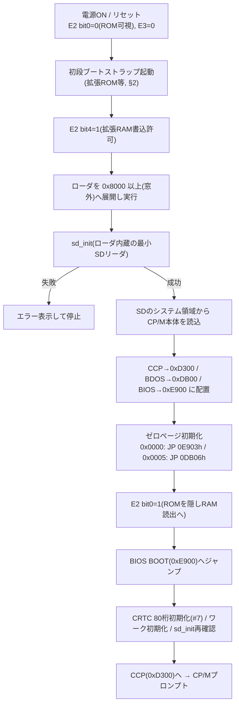

# ブートシーケンス・ローダ設計

関連issue: #5 / 親 #3
参照: `doc/設計/01_メモリマップ.md`、`doc/設計/03_BIOS構成.md`、`doc/設計/06_SDドライバ.md`、
`doc/設計/05_ディスクサブシステム.md`

## 1. 目的

電源ON から CP/M(CCP)起動までの一連のブート手順と、ブートローダの配置・動作を確定する。
N-BASIC ROM 下に RAM を切り替え(#4)、SD(#9)から CP/M 本体を RAM へ読み込み起動する。

## 2. ブート入口(初段の起動方法)

PC-8001 無印で電源ON直後にローダへ制御を渡す方法。候補と方針:

| 方法 | 概要 | 採否 |
|------|------|------|
| 拡張ROM(0x6000〜0x7FFF) | 本体内拡張ROMソケットにブートストラップを置き、起動時に実行させる | **推奨(本命)** |
| N-BASICから手動ロード | N-BASIC起動後、SDアクセス手段でローダをロードして実行 | 代替(暫定/開発時) |
| ESC+リセット(PC-8031系ブート) | ポート0xF8〜0xFB経由の外部ブート。sdd基板が模倣可能か不明 | 要調査 |

> 採用する初段手段は、手持ち基板構成(拡張ROMソケットの有無等)に依存するため確定が必要(要確認)。
> 本設計は「初段で 0x8000 以上にローダを展開して実行できる」ことを前提に、以降の手順を定義する。

## 3. ブートシーケンス

### 各段の要点

1. **電源ON**: N-BASIC ROM が 0x0000 から可視(E2 bit0=0)。E3=バンク0。
2. **初段ブートストラップ**: §2 の手段で制御取得。**E2 bit4=1** とし拡張RAMへ書込可能にする
   (この時点では bit0=0 のままでよい=ROMを読みつつRAMへ書ける、#4)。
3. **ローダ展開**: ローダ本体を **0x8000 以上(バンク窓外)** に置いて実行する。
   これにより後段の ROM→RAM 切替でローダ自身が消えない(#4 §5・自己消去回避)。
4. **SD初期化と本体読込**: ローダ内蔵の最小SDリーダ(#9のサブセット)で `sd_init` し、
   SDのシステム領域(ドライブAの OFF 領域=先頭ブロック群, #8)から CP/M本体イメージを読む。
5. **配置**: CCP→0xD300、BDOS→0xDB00、BIOS→0xE900(#4)。いずれも 0x8000 以上=本体RAMなので
   バンク窓の影響を受けない。
6. **ゼロページ初期化**: 0x0000=`JP 0E903h`(WBOOT)、0x0005=`JP 0DB06h`(BDOSエントリ)、
   既定DMA等(#4)。ゼロページは窓内(<0x8000)だが、E2 bit4=1 のため bit0=0(ROM可視)でも
   拡張RAMへ書ける。
7. **ROMを隠す**: **E2 bit0=1** で 0x0000〜の読出を拡張RAMへ切替。以後 64KB全域がRAM。
8. **BIOS BOOTへ**: 0xE900 へジャンプ。CRTC 80桁初期化(#7)、ワーク初期化、`sd_init` 再確認、
   ドライブA選択、CCP(0xD300)へ制御を渡す。

## 4. ローダの責務とSDリーダ

- ローダは **BIOSがまだ無い段階**で動くため、**自前の最小SDブロックリーダ**を内蔵する
  (#9 の `sd_init`/`sd_read_block` 相当のサブセット)。
- 読込対象はシステム領域(#8 の OFF=2トラック=先頭32ブロック)に格納された
  CCP/BDOS/BIOS イメージ。配置順・オフセットは #8 のレイアウトに従う。
- ローダ・内蔵SDリーダ・一時バッファはすべて **0x8000 以上**に置く。

## 5. システムイメージの所在

- SD ドライブA(LBA先頭)の **OFF 領域(先頭32ブロック=16KB)** に CCP/BDOS/BIOS(+必要なら
  ローダ second stage)を配置する(#8)。
- 配置の具体オフセットは #8 のシステム領域レイアウトと、#10(SD作成ツール)での書込みに整合させる。
- これは WBOOT(#10)の再ロード元としても用いる候補(別バンク保持案と #10 で比較)。

## 6. エラー処理

- `sd_init` 失敗・本体読込失敗時は、ブート継続不能としてエラー表示し停止する。
- エラー表示は CRTC 初期化前なら最小限の手段(N-BASIC ROM の表示ルーチン利用 or 単純ビープ)、
  CRTC 初期化後は通常のコンソール出力(#7)。表示方法は実装時に確定。

## 7. 申し送り

| 項目 | 後続/要確認 |
|------|------|
| 初段ブート手段の確定(拡張ROM/N-BASICロード/ESC+リセット) | 要確認(基板構成依存) |
| システムイメージのSD配置詳細(オフセット) | #8 / #10 整合 |
| WBOOT の再ロード元(OFF領域 or 別バンク原本) | #10 |
| ブート前エラー表示手段 | 実装時 |
| ローダ内蔵SDリーダと BIOS SDドライバのコード共有 | 実装時(#9) |
