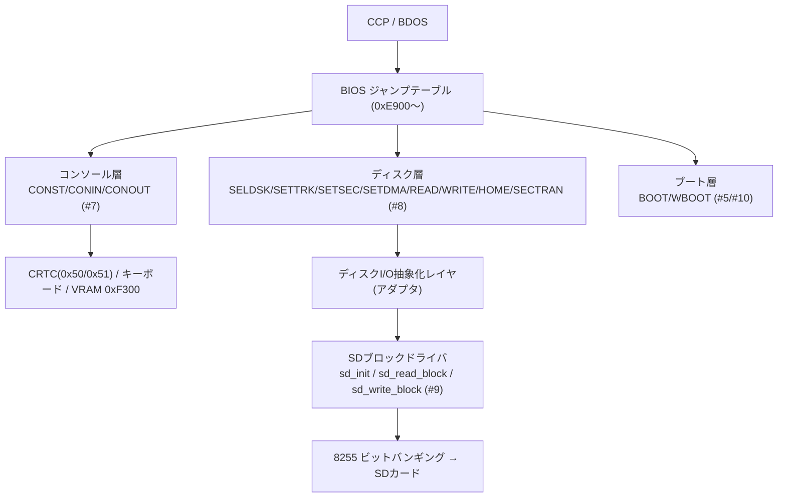

# BIOS全体構成・ジャンプテーブル設計

関連issue: #6 / 親 #3
参照: `doc/設計/01_メモリマップ.md`、`doc/概要検討/概要検討.md`

## 1. 目的

PC-8001向け CP/M 2.2 BIOS の全体構成を定義する。ジャンプテーブル、各エントリの責務と
レジスタ規約、ワークエリア配置、ディスクI/O抽象化レイヤのインターフェースを確定する。
コンソール詳細は #7、ディスク詳細は #8、SDドライバは #9、ブート/割込みは #5/#10 に委譲する。

## 2. 配置(#4 準拠)

- BIOS は `BIOS_ORG = 0xE900`、予算 0xA00(上端 0xF2FF)。
- 先頭にジャンプテーブル(17エントリ × 3バイト = 51バイト, 0xE900〜0xE932)。本体コードは 0xE933〜。
- 大きなワーク(512Bバッファ等)は BIOS領域に置かず 0x8000台の本体RAMへ(#4 方針)。

## 3. ジャンプテーブル

各エントリは `JP <ルーチン>`(3バイト)。`vec(n) = BIOS_ORG + 3*n`。
ゼロページ 0x0000 は WBOOT(n=1, **0xE903**)を指す(#4)。

| n | エントリ | アドレス | 役割 |
|---|---------|----------|------|
| 0 | BOOT   | 0xE900 | コールドブート初期化(#5 から呼ばれる) |
| 1 | WBOOT  | 0xE903 | ウォームブート(CCP/BDOS再ロード, #10) |
| 2 | CONST  | 0xE906 | コンソール入力状態(A=0xFF:有, 0:無) |
| 3 | CONIN  | 0xE909 | コンソール1文字入力(→A) |
| 4 | CONOUT | 0xE90C | コンソール1文字出力(C→) |
| 5 | LIST   | 0xE90F | プリンタ出力(未使用・ダミー) |
| 6 | PUNCH  | 0xE912 | パンチ出力(未使用・ダミー) |
| 7 | READER | 0xE915 | リーダ入力(未使用・A=0x1A) |
| 8 | HOME   | 0xE918 | トラック0へシーク |
| 9 | SELDSK | 0xE91B | ディスク選択(C=drive→HL=DPH, 無効時HL=0) |
| 10 | SETTRK | 0xE91E | トラック設定(BC) |
| 11 | SETSEC | 0xE921 | セクタ設定(BC) |
| 12 | SETDMA | 0xE924 | DMAアドレス設定(BC) |
| 13 | READ   | 0xE927 | セクタ読込(→A=0:OK/1:err) |
| 14 | WRITE  | 0xE92A | セクタ書込(C=書込タイプ→A=0:OK/1:err) |
| 15 | LISTST | 0xE92D | プリンタ状態(A=0xFF:常時可) |
| 16 | SECTRAN| 0xE930 | 論理→物理セクタ変換(BC,DE→HL) |

LIST/PUNCH/READER は PC-8001 に対応デバイスなしのためダミー実装(#6スコープ)。

## 4. 階層構造

## 5. BIOSワークエリア(0x8000台・本体RAM)

| ワーク | 用途 |
|--------|------|
| `cur_disk` | 選択中ドライブ番号 |
| `cur_track` / `cur_sector` | SETTRK/SETSEC 値 |
| `cur_dma` | SETDMA 値(BDOSが渡すDMAアドレス) |
| `sec_buf`(512B) | 512Bセクタ デブロッキング/RMW バッファ |
| `buf_lba` / `buf_dirty` | バッファ中の物理セクタLBAと変更フラグ |
| `bank_save` 等 | バンク切替時の退避(#10) |

配置アドレスの具体値は #8(ディスク)実装時に確定する(0x8000〜0xCFFF の TPA上端側に未使用域を確保)。
> 注意: ワークを TPA(0x0100〜0xD2FF)内に置くと TPA を侵食する。CP/M の MEM SIZE(BDOSが報告する
> 上端=CCP直下)を BIOS ワーク分だけ下げて確保するか、BIOS領域に収める方針は #6/#8 で確定。

## 6. ディスクI/O抽象化レイヤ

BIOS のディスク層は、機種非依存の CP/M 規約(SELDSK 等)を、**SDブロックドライバの
3関数**に変換するアダプタとして実装する。これにより SDブート方式(今回は SD-DOS型)を
差し替え可能にする。

### 下位ドライバIF(#9 が実装)

| 関数 | 入力 | 出力 | 説明 |
|------|------|------|------|
| `sd_init` | — | CY=1:失敗 | SDカード初期化 |
| `sd_read_block` | DE:HL=LBA(32bit), 転送先=窓外バッファ | CY=1:失敗 | 512B 1ブロック読込 |
| `sd_write_block` | DE:HL=LBA(32bit), 転送元=窓外バッファ | CY=1:失敗 | 512B 1ブロック書込 |

### READ/WRITE の流れ(概要・詳細は #8)

1. (cur_disk, cur_track, cur_sector) から物理 512B セクタの LBA と、その中の 128B オフセットを算出。
2. 目的LBAが `sec_buf` に未ロードなら(必要に応じ `buf_dirty` をフラッシュしてから)`sd_read_block`。
3. READ: `sec_buf` の該当128Bを `cur_dma` へコピー。WRITE: `cur_dma` の128Bを `sec_buf` に反映し
   `buf_dirty` を立てる(遅延書込)/または即 `sd_write_block`(方式は #8)。
4. `cur_dma` が窓内(<0x8000)の場合のバンク窓退避処理は #4 §5 に従う。

## 7. DPH / DPB(概要)

SELDSK は選択ドライブの **DPH(Disk Parameter Header)** アドレスを HL で返す。
DPH は SECTRAN変換表・ディレクトリバッファ・DPB へのポインタ等を持つ。DPB の具体値
(SPT/BSH/BLM/DSM/DRM/AL0/AL1/CKS/OFF)は #8 で確定する。本書ではIFのみ定義。

## 8. コールド/ウォームブート(概要)

- BOOT(コールド): CRTC初期化(80桁, #7)、ワーク初期化、`sd_init`、CCPへ。詳細は #5。
- WBOOT(ウォーム): CCP/BDOS を再ロードしゼロページを再設定。再ロード元は #10 で決定。

## 9. 申し送り

| 項目 | 後続 |
|------|------|
| コンソール各エントリの実装(CRTC/キーボード/端末エミュ) | #7 |
| ディスク層の詳細・DPB値・デブロッキング | #8 |
| SDブロックドライバ実装 | #9 |
| BOOT/WBOOT詳細・割込み方針・ワーク退避 | #5 / #10 |
| BIOS実サイズ確定 → #4 メモリマップの予算0xA00見直し | #4 連動 |
