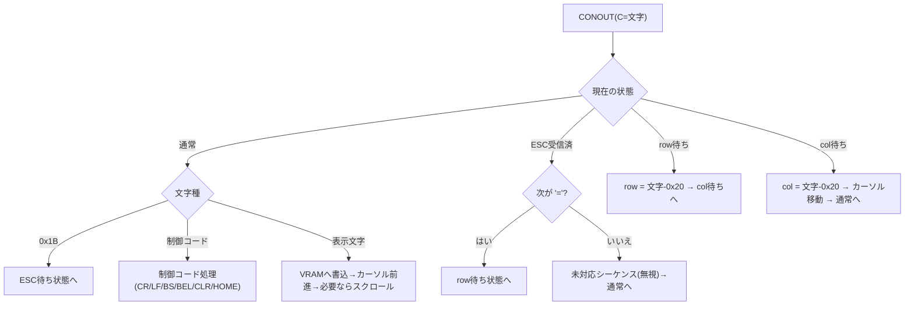

# コンソール/端末設計

関連issue: #7 / 親 #3
参照: `doc/設計/03_BIOS構成.md`(CONST/CONIN/CONOUT)、`doc/概要検討/概要検討.md`

## 1. 目的

PC-8001 の 80桁テキスト画面とキーボードを CP/M コンソール(BIOS の CONST/CONIN/CONOUT)
として実装する設計を定義する。CP/Mアプリ互換のため **ADM-3A 相当の端末エミュレーション**を行う。
英数モードのみ(漢字非対応)。

## 2. 画面ハードウェア(確定事項)

| 項目 | 値 | 出典 |
|------|----|------|
| CRTC | μPD3301 + DMA μPD8257 | ENRI資料 |
| テキストVRAM | 0xF300〜0xFEB7 | ENRI資料 |
| 1行の構成 | 表示80バイト + アトリビュート40バイト = **120バイト** | ENRI資料 |
| 行数 | 最大25行(80×120×... → 120×25=3000=0xBB8) | ENRI資料 |
| CRTC パラメータポート | 0x50 | ENRI資料 |
| CRTC コマンドポート | 0x51(ICW/OCW) | ENRI資料 |
| 表示制御 | ポート0x40 の d3(/CLDS) | ENRI資料 |

画面は DMA(μPD8257)が VRAM を CRTC へ転送して表示する。**CONOUT は VRAM(0xF300〜)を
直接書き換える**ことで画面に反映される。

### VRAM アドレス計算

- 行 `r`(0..24)の先頭 = `0xF300 + r*120`。
- 表示セル(col `c`, 0..79)= 行先頭 + c。
- アトリビュート領域 = 行先頭 + 80 〜 +119(40バイト)。

## 3. CRTC 初期化(80桁モード)

BOOT(#5)時に CRTC を 80桁×25行へ初期化する。手順(ENRI資料に基づく):

1. ポート0x51 に 0x00 を出力(ICW: RESET)→ パラメータ書込可能化。
2. DMA(μPD8257)を画面転送用に設定。
3. ポート0x50 へ ICW SCREEN FORMAT パラメータ(80桁/25行/モード等)を順次書込。
4. OCW で割込みマスク設定 → DMA 実行 → OCW2 DISPLAY START。
5. ポート0x40 の d3(/CLDS)を 0 にして設定完了。

> ICW SCREEN FORMAT の各パラメータ値(行数・桁数・カーソル形式等)は実装時に確定する(要確認: ENRI資料 ICW詳細/実機)。

### アトリビュート方針(英数モノクロ)

英数モノクロ表示のため、各行のアトリビュート領域を **「キャラクタ・ノーマル」** に初期化し、
色・装飾は使わない。初期化時に全行のアトリビュートを設定し、以後は表示バイトのみ操作する。
(アトリビュートは1行40バイト=最大20組。トランスペアレント/ノントランスペアレントの選択と
具体バイトは実装時に確定。)

## 4. カーソル管理

- BIOSワークに **カーソル位置(row, col)** を保持する。
- 画面上のカーソル表示は CRTC のカーソル機能を用いる(または非表示でも可)。具体は実装時。
- CONOUT は現在カーソル位置の VRAM セルに文字を書き、col を進める。col>79 で次行へ(必要ならスクロール)。

## 5. スクロール(ソフトウェア)

ハードスクロールは使わず、VRAM のメモリ操作で行う:

- 行 1〜24 を行 0〜23 へコピー(`24*120 = 2880` バイトを 0xF300+120 → 0xF300)。
- 最終行(行24)の表示領域を空白(0x20)で埋め、アトリビュートを再設定。
- カーソルは最終行に留める。

## 6. 端末エミュレーション(ADM-3A 相当)

CONOUT は受信文字を解釈し、制御コード・エスケープシーケンスを処理する。
CP/M アプリ(WordStar 等)が想定する **ADM-3A** を基準とする。

### 制御コード

| コード | 動作 |
|--------|------|
| 0x07 BEL | ビープ(BEEP音) |
| 0x08 BS  | カーソル左 |
| 0x0A LF  | カーソル下(最下行ならスクロール) |
| 0x0D CR  | カーソルを桁0へ |
| 0x1A | 画面クリア + ホーム(ADM-3A) |
| 0x1E | ホーム(ADM-3A) |

### カーソルアドレッシング(ADM-3A)

- リードイン `ESC =`(0x1B 0x3D)に続き、`row+0x20`、`col+0x20` の2バイトで位置指定。
- CONOUT は状態機械でエスケープシーケンスを蓄積・解釈する(下図)。

> 対応シーケンスは ADM-3A の最小セット(位置指定・クリア・ホーム・カーソル移動)から開始し、
> 必要に応じて拡張する。VT52 対応が必要になった場合も同じ状態機械を拡張して対応する。

## 7. キーボード入力(CONST / CONIN)

- **CONST**: キー入力の有無を返す(A=0xFF:有 / 0x00:無)。1文字を内部バッファに先読みする方式でもよい。
- **CONIN**: 1文字を ASCII で返す(A)。
- 英数モードのみ。**制御キー(Ctrl+英字 → 0x00〜0x1F)、SHIFT、リターン/BS/ESC** を処理。カナは非対応。

### キーマトリクス走査(確定: ポート 0x00〜0x09)

PC-8001 のキーボードは **入力ポート 0x00〜0x09(10ポート)** に接続されたキーマトリクスを
読んで判定する(ENRI資料 使用ポート表)。各ポートが1行ぶん(8列=8bit)を返し、
**10行 × 8列 = 80キー位置** を構成する。各bitは押下状態を表す(極性は実装時に実機/エミュで確認)。

走査ロジック:
1. ポート 0x00〜0x09 を順に入力し、各ビット(列)の押下状態を取得。
2. 前回スキャンと比較し新規押下キーを特定(チャタリング除去・リピート制御)。
3. 行×列 → キーコード → ASCII 変換(SHIFT/CTRL 考慮、カナ無効)。
   CTRL+英字 → 0x00〜0x1F、SHIFT → 記号/大文字。
4. CONIN 用の1文字バッファへ格納(CONST はバッファ有無を返す)。

> 行×列とキーの対応(どの行のどのbitがどのキーか)、押下極性、SHIFT/CTRL/STOP/カナ等の
> 特殊キー位置は、ENRI資料のマトリクス図および実機/エミュレータで確定する(対応表は実装時に作成)。

### 参考: PC-8001 主要I/Oポート(ENRI資料)

| ポート | 用途 |
|--------|------|
| 0x00〜0x09 | キーボード(入力) |
| 0x30 d0 | 80桁/40桁 切替 |
| 0x40 | 表示制御(出力)/ストローブ等 |
| 0x50 / 0x51 | μPD3301(CRTC) パラメータ/コマンド |
| 0x60〜0x68 | μPD8257(DMA) |
| 0xE2 / 0xE3 | PC8001-MEM バンク制御(#4) |

## 8. テスト方針(#12連携)

- 自作Pythonエミュレータに **VRAM(0xF300〜)モデルと CRTC ポート、キーボード入力注入** を実装。
- CONOUT に文字列/ADM-3Aシーケンスを与え、VRAM内容(画面)が期待通りか検証。
- スクロール・カーソル移動・画面クリアの単体テスト。
- CONIN/CONST はキー入力を注入して ASCII 変換・制御キーを検証。

## 9. 申し送り

| 項目 | 後続/要確認 |
|------|------|
| CRTC ICW パラメータ具体値 | 要確認(実装時) |
| アトリビュート具体バイト・モード選択 | 要確認(実装時) |
| キーボード走査ポート・マトリクス | 要確認(ENRI資料/実機) |
| BOOT からの CRTC 初期化呼び出し | #5 |
| カーソルのCRTC表示 or ソフト表示の選択 | 実装時 |
