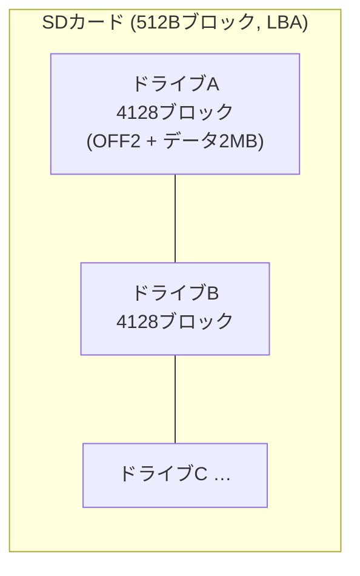
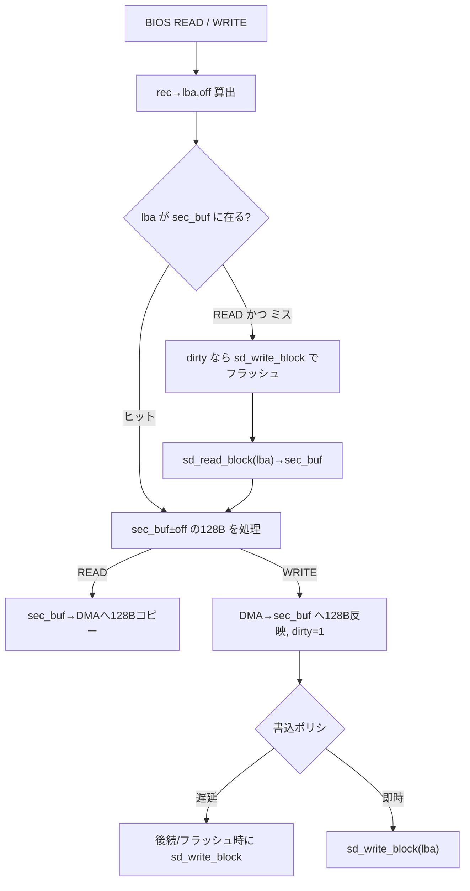

# ディスクサブシステム設計

関連issue: #8 / 親 #3
参照: `doc/設計/03_BIOS構成.md`(ディスク層/抽象化)、`doc/設計/06_SDドライバ.md`(ブロックドライバ)、
`doc/設計/01_メモリマップ.md`(バンク窓制約)

## 1. 目的

SDカードを CP/M 2.2 のディスクとして見せるための設計を定義する。DPB(ディスクパラメータ)、
ディスクイメージ形式、CP/M 128B レコードと SD 512B ブロックのデブロッキング、
read-modify-write、論理↔物理マッピングを確定する。

## 2. 方針

- SD は **固定ディスク**(リムーバブル扱いしない)として運用。媒体交換チェックなし(CKS=0)。
- **生セクタ運用**(FAT不使用)。SDの先頭から CP/M ドライブ領域を連続配置する。
- 1ドライブ = 2MB。複数ドライブ(A:, B:, …)を SD 上に連続配置する。

## 3. ディスクジオメトリと DPB(確定値)

| 項目 | 値 | 意味 |
|------|----|------|
| 1レコード | 128バイト | CP/M セクタ |
| ブロックサイズ(BLS) | 2KB | BSH=4 |
| 1トラックのレコード数(SPT) | 64 | 8KB/トラック(SD上は論理値) |
| 総ブロック数 | 1024 | データ領域 = 1024×2KB = 2MB |
| ディレクトリエントリ数 | 512 | 16KB = 8ブロック |
| システム予約トラック(OFF) | 2 | 先頭16KB(ブート/CCP/BDOS/BIOS原本) |

### DPB 値

| フィールド | 値 | 備考 |
|-----------|----|------|
| SPT | 64 (0x0040) | 128Bレコード/トラック |
| BSH | 4 | BLS=128<<4=2KB |
| BLM | 15 (0x0F) | (2^BSH)-1 |
| EXM | 0 | BLS=2KB かつ DSM>255 → 0 |
| DSM | 1023 (0x03FF) | 最大ブロック番号(1024ブロック) |
| DRM | 511 (0x01FF) | ディレクトリ512エントリ |
| AL0 | 0xFF | ディレクトリ用8ブロック予約(上位8bit) |
| AL1 | 0x00 | 同上(下位8bit) |
| CKS | 0 | 固定ディスク(チェックサム無し) |
| OFF | 2 | システム予約トラック数 |

導出確認: ディレクトリ 512×32=16KB=8ブロック → AL0/AL1 上位8bit=`0xFF00`。
データ 1024×2KB=2MB。1ドライブ総レコード = `OFF*SPT + (DSM+1)*(BLS/128)` = `2*64 + 1024*16` = **16512 レコード** = 4128 × 512Bブロック。

> 値は設計選択(2KBブロック/2MBドライブ/512エントリ)。容量や用途に応じ調整可能だが、
> 変更時は EXM/AL0/AL1/CKS の再計算が必要。

## 4. SDイメージ上のレイアウト(マッピング)

- ドライブ `d`(0=A)の先頭LBA = `d * 4128`(= `DRIVE_BLOCKS`)。
- 各ドライブ内: 先頭に OFF(2トラック=128レコード=32ブロック)のシステム領域、続いてデータ領域。

### 論理(track, sector)→ 物理(LBA, offset)

CP/M の BIOS が受け取る track/sector(SECTRAN後)から、SDの512BブロックLBAを算出する。

1. 絶対レコード番号: `rec = (track + OFF) * SPT + sector`（sector は 0..SPT-1, SECTRAN恒等)
2. SDブロック: `lba = d*DRIVE_BLOCKS + (rec >> 2)`（rec/4。512B=4レコード）
3. ブロック内オフセット: `off = (rec & 3) * 128`

### SECTRAN

SD はランダムアクセスでインターリーブ不要のため **SECTRAN は恒等変換**(入力セクタをそのまま返す)。

## 5. デブロッキング / read-modify-write

CP/M は 128B 単位、SD は 512B 単位。BIOS の READ/WRITE で 512Bバッファ(`sec_buf`, #6 ワーク,
**0x8000台に配置**)を介して変換する。

- **read-modify-write**: WRITE で対象512Bが未ロードなら一旦 `sd_read_block` → 該当128B差替 → 書込。
- **書込ポリシ**: 既定は**遅延書込**(同一512B内の連続書込を集約)。CP/M の WRITE タイプ
  (C レジスタ: 0=通常/1=ディレクトリ/2=未使用ブロック先頭)を見て、ディレクトリ書込時は
  即時フラッシュして整合性を確保する。WBOOT/ドライブ切替時にも dirty をフラッシュ。
- **バンク窓退避**: `cur_dma` が窓内(<0x8000)の場合、#4 §5 に従い窓外バッファ経由で授受する。

## 6. BIOS ディスクエントリの動作(#6準拠)

| エントリ | 動作 |
|----------|------|
| HOME | cur_track=0(必要ならdirtyフラッシュ) |
| SELDSK | C=ドライブ。範囲内なら対応 DPH アドレスを HL で返す(範囲外は HL=0) |
| SETTRK/SETSEC/SETDMA | ワーク(cur_track/cur_sector/cur_dma)に保存 |
| READ/WRITE | §4/§5 に従い 512B デブロッキングで授受、A=0:OK/1:err |
| SECTRAN | 恒等(BC→HL) |

DPH は各ドライブ分用意し、共通の DPB を指す(同一ジオメトリ)。ディレクトリバッファ(128B)、
チェックサム/アロケーションベクタは BDOS が要求するサイズで BIOS ワークに確保する。

## 7. ディスクイメージ作成(#10連携)

ホスト側ツール(#10)が、上記レイアウトの生イメージを作成する:
- ドライブごとに 4128×512B の領域を確保、ディレクトリ初期化(0xE5 で埋める)。
- システム領域(OFF)へ CCP/BDOS/BIOS/ローダを配置(ブート設計 #5/#2 と整合)。
- `.COM` 等のファイルを CP/M ディレクトリ形式で書き込み。

## 8. テスト方針(#12連携)

- 自作Pythonエミュ + SDカードモデル(イメージ)で、SELDSK→SETTRK/SEC/DMA→READ/WRITE を検証。
- 128B境界跨ぎ・512B境界・RMW・遅延書込フラッシュの単体テスト。
- ディレクトリ操作(DIR/ERA/SAVE)が BDOS 経由で正しく動くか結合テスト。

## 9. 申し送り

| 項目 | 後続 |
|------|------|
| BIOS ワーク(sec_buf 等)の具体アドレス | #6 連動 |
| システム領域(OFF)への配置・ブート読込 | #5 / #2 |
| WBOOT時の原本再ロード元(OFF領域 or 別バンク) | #10 |
| イメージ作成ツール | #10 |
| ドライブ数の確定 | 実装時(SD容量に応じ) |
