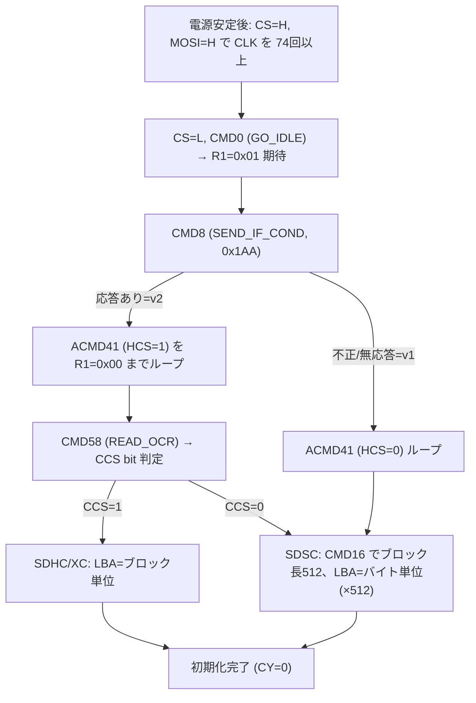

# SD-DOS型 ビットバンギング SDドライバ設計

関連issue: #9 / 親 #3
参照: `doc/設計/03_BIOS構成.md`(下位ドライバIF)、`doc/概要検討/概要検討.md`

## 1. 目的と前提

CP/M の BIOS ディスク層(#6)から呼ばれる **SDブロックドライバ**(`sd_init` /
`sd_read_block` / `sd_write_block`)を、**8255 によるビットバンギング SPI** で実装する。

- 対象ハード: ちくらっぺ氏の **micorSDドライブ基板(`chiqlappe/sdd`)+ 8KB拡張RAM** (手持ち・稼働実績あり)。
- **SD-DOS のソースは明示ライセンスがないためコードは流用しない**。SD SPI プロトコルは
  公開標準であり、本ドライバは独自実装する。基板のポート/配線仕様(ハードの事実)は参照する。
- 運用は **生セクタ(FAT不使用)**。FATは持たず、SDの論理ブロック(LBA)を直接読み書きする。

## 2. ハードウェアインターフェース(8255)

PC-8001 拡張ポートに接続した 8255(PPI)経由で SD と SPI 通信する。

| 信号 | 向き | 8255 | 備考 |
|------|------|------|------|
| CLK (SCLK) | 出力 | ポート(出力) | SPI クロック |
| MOSI (DI) | 出力 | ポート(出力) | マスタ→SD |
| CS (/SS) | 出力 | ポート(出力) | チップセレクト(Lowで選択) |
| MISO (DO) | 入力 | ポート(入力) | SD→マスタ |

- 8255 の **ベースI/Oポートアドレス、各信号のビット割当、制御ワード(モード0)** は
  **sdd 基板回路図および SD-DOS ソースから確定する(要確認)**。本設計は信号レベルの
  プロトコルを定義し、ポート定数はアセンブル時の equ で与える(実値確定後に設定)。
- 電気的事項(3.3V系SDと5V系PC-8001のレベル変換・プルアップ)は基板側で対応済み前提。

> 要確認項目(#9実装前に確定): 8255ベースポート、PA/PB/PCの割当、CLK/MOSI/CS/MISOの各bit、制御ワード値。

## 3. SPI ビットバンギング

- モード: **SPI mode 0**(CPOL=0/CPHA=0、立上りでサンプル)、**MSB ファースト**、8bit単位。
- 1バイト送信(`spi_out`): 各bitで「MOSIにbit設定 → CLK=1 → CLK=0」を8回。
- 1バイト受信(`spi_in`): 各bitで「CLK=1 → MISO読取 → CLK=0」を8回(MOSIは1固定=0xFF送信)。
- 送受信は全二重だが、本用途では送信時/受信時で役割を分ける実装で十分。
- 速度はビットバンギングのため低速(CPU占有)。**SD規格が要求する初期化クロック ≤400kHz は
  ビットバンギングでは自然に満たされる**。CP/M用途では転送速度低下は許容(概要検討の通り)。

### 共通作法

- **CS の立下げ/立上げの前後に 8クロック(1バイト 0xFF)空送り**して安定化する。
- **R1応答待ち(NCR)**: コマンド送出後すぐには応答が返らず最大8バイトほど 0xFF が続く。
  **MSB(bit7)=0 のバイトが来るまで最大Nバイトをポーリング**し、それを R1 とする(超過でCY=1)。

## 4. SD初期化シーケンス(`sd_init`)

### コマンド詳細

| コマンド | 引数 | CRC | 応答 | 判定 |
|----------|------|-----|------|------|
| CMD0 (GO_IDLE) | 0x00000000 | **0x95** | R1 | 0x01(idle)期待 |
| CMD8 (SEND_IF_COND) | 0x000001AA | **0x87** | R7(5B) | **下位12bit=0x1AA のエコーバック一致**を確認(不一致は非互換) |
| ACMD41 | HCS bit | ダミー可 | R1 | **CMD55(R1) を前置してから CMD41** を送る2コマンド対。R1=0x00 までループ |
| CMD58 (READ_OCR) | 0 | ダミー可 | R3(5B) | OCR 最上位バイトの **bit6 = CCS**(32bit中bit30)で SDHC/XC 判定 |
| CMD16 (SET_BLOCKLEN) | 512 | ダミー可 | R1 | SDSC のみ発行(512は既定値だが明示設定) |
| CMD17 / CMD24 | LBA | ダミー可 | R1 | §5 |

- CRC が正しく必要なのは **CMD0(0x95)/CMD8(0x87)** のみ。以降は CRC チェックOFFのためダミー可。
- **ACMD41 = CMD55 → CMD41**(各反復で CMD55 を先行送出)。単独コマンドではない点に注意。
- 失敗(タイムアウト/不正応答/CMD8エコー不一致)時は CY=1 で返す。
- **CCS(カード容量種別)を保持**し、以降の read/write の LBA 解釈に使う(§5)。

## 5. ブロック読み書き

**マルチブロック(CMD18/CMD25)は非対応**。単一ブロック(CMD17/CMD24)のみを使う(#8 もこれを前提とする)。

### LBA の扱い
- SDHC/XC(CCS=1): 引数はブロック番号(そのまま)。
- SDSC(CCS=0): 引数はバイトアドレス(= ブロック番号 × 512)。

### `sd_read_block`(CMD17 READ_SINGLE_BLOCK)
1. CS=L、CMD17(LBA)送出 → R1=0x00 確認。
2. データトークン **0xFE** を待つ(タイムアウト管理)。
3. 512バイトを `spi_in` で受信し窓外バッファへ格納。続くCRC 2バイトを読み捨て。
4. CS=H、ダミークロック。CY=0。

### `sd_write_block`(CMD24 WRITE_SINGLE_BLOCK)
1. CS=L、CMD24(LBA)送出 → R1=0x00 確認。
2. データトークン **0xFE** を送出し、512バイトを `spi_out`、CRC 2バイト(ダミー)。
3. データレスポンス下位5bitが **0b00101**(accepted)を確認。
4. **busy 解除待ち**(SDが 0x00 を返す間ビジー、0xFF で完了)。
5. CS=H、ダミークロック。CY=0。

### #6 下位ドライバIFとの対応
| #6 IF | 入力 | 出力 |
|-------|------|------|
| `sd_init` | — | CY=1:失敗 |
| `sd_read_block` | DE:HL=LBA, 転送先=窓外バッファ | CY=1:失敗 |
| `sd_write_block` | DE:HL=LBA, 転送元=窓外バッファ | CY=1:失敗 |

(LBA は 32bit。本構成のディスク容量では実質下位で足りるが、IFは32bitで受ける。)

## 6. エラー処理・タイムアウト

- 各待ち(R1応答、データトークン、busy解除)に**ループ上限**を設け、超過で CY=1。
- 初期化失敗時、BIOSは起動継続不能のためブートエラー表示(#5)。
- read/write 失敗は BIOS READ/WRITE が A=1(エラー)を CP/M へ返す(#8)。

## 7. ライセンス

- SD SPI プロトコルは SD アソシエーション等の公開仕様に基づく独自実装。
- SD-DOS(`chiqlappe/SD-DOS`)のソースコードは**流用しない**(明示ライセンスなし)。挙動理解の
  読解参考にとどめる。基板のポート/配線(ハード仕様)は事実情報として参照する。
- 詳細は #14(ライセンス整理)。

## 8. テスト方針(#12連携)

- 自作Pythonエミュレータに **8255ビットバンギングSPIのモデル + SDカードモデル(イメージファイル)**
  を実装し、`sd_init`→`sd_read_block`/`sd_write_block` を検証する。
- 既知パターンを書いた SDイメージで read 一致、write→read 往復一致を確認。
- 実機(手持ち sdd 基板)での最終確認。

## 9. 申し送り

| 項目 | 後続 |
|------|------|
| 8255ベースポート・ビット割当・制御ワードの確定 | #9実装前(要確認) |
| READ/WRITE からの呼び出し・デブロッキング・RMW | #8 |
| 初期化失敗時のブートエラー表示 | #5 |
| エミュレータのSDボードモデル実装 | #12 派生の実装 |
