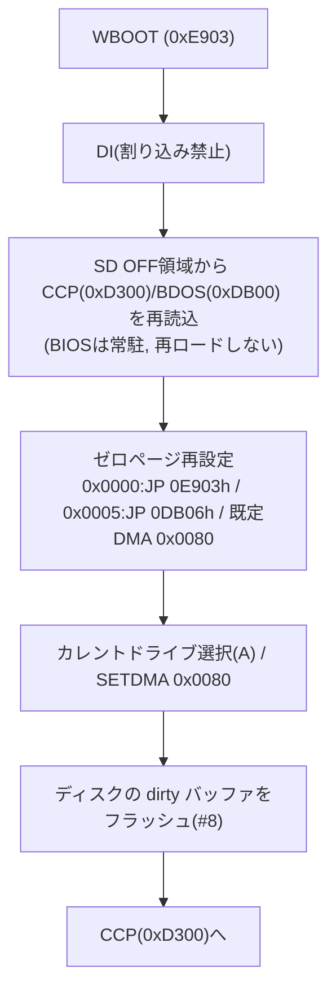

# ウォームブート・割り込み/RST7・リセット方針

関連issue: #10 / 親 #3
参照: `doc/設計/01_メモリマップ.md`、`doc/設計/03_BIOS構成.md`、`doc/設計/02_ブートシーケンス.md`、
`doc/設計/05_ディスクサブシステム.md`

## 1. 目的

ウォームブート(WBOOT)時の CCP/BDOS 再ロード方法、CP/M 動作中の割り込み方針(特に PC-8001 の
RST7/VRTC との関係)、リセット時の挙動と N-BASIC への復帰を確定する。

## 2. ウォームブート(WBOOT)

TPA で実行したプログラムが CCP/BDOS を破壊しうるため、WBOOT で再ロードする。
WBOOT は 0x0000 の `JP 0E903h`(#4)から、またはプログラム終了/Ctrl-C 時に BDOS 経由で呼ばれる。

### 再ロード元の決定

| 案 | 内容 | 採否 |
|----|------|------|
| A: SDシステム領域から再読込 | BIOS常駐のSDドライバ(#9)で OFF領域(#8)の CCP/BDOS を再読込 | **採用(主)** |
| B: 別バンクに原本保持 | PC8001-MEM の別バンクに CCP/BDOS 原本を保持し復元 | 将来の最適化 |

- 採用理由(A): BIOS は常駐しSDドライバが使えるため、**SDを単一の正本**として扱え実装が単純。
- 代償: 毎WBOOTで約5.6KB(CCP 2KB + BDOS 3.5KB)をSDから読む遅延。CP/M用途では許容。
- 最適化(B): バンク保持で高速化可能だが、バンク窓制約(#4 §5)の取り回しが要るため将来検討。

### WBOOT 手順

- BIOS(0xE900〜)は常駐し再ロードしない。再ロードは CCP+BDOS のみ。
- WBOOT 前にディスクの遅延書込バッファ(#8)をフラッシュし整合性を保つ。

## 3. 割り込み方針

### 基本方針: CP/M 動作中は割り込み禁止(DI)

- PC-8001 は VRTC 等で **RST7(0x0038)** 割り込みを使う(概要検討/ENRI)。
- CP/M のコンソール入力は **ポーリング**(#7)で行い、**動作中は原則 DI** とする。
  これにより RST7/VRTC と CP/M ゼロページの競合を避け、バンク切替(#4 §5)中の安全も確保する。
- マスカブル割り込みは DI で無効化される。バンク切替・SD I/O のクリティカル区間は特に DI を厳守。

### ゼロページ RST ベクタの防御

- 動作中は割り込みを使わないが、万一の発火に備え **0x0038(RST7)に安全なスタブ(`EI`+`RET` 等)**
  を置く(暴走防止)。他の RST(0x0008〜0x0030)も CP/M/アプリ規約に反しない範囲で未使用。
- 将来タイマ等で割り込みを使う場合は、0x0038 に正規ハンドラを置き、CP/M ゼロページ規約
  (0x0000/0x0005 のジャンプ)を侵さない範囲で運用する。

### DMA 表示について

- 画面表示の μPD8257 DMA は CPU を一時停止させる(バス制御)が、これは CP/M が管理する
  「割り込み」ではなく透過的なバス占有である。CP/M 動作に特別な配慮は不要(速度低下のみ)。

## 4. リセット・N-BASIC への復帰

- **ハードリセット**で PC8001-MEM は E2 bit0=0(ROM可視)・E3=バンク0 に戻る(#4)。
  すなわちリセットすると N-BASIC へ戻る(コールドスタート)。CP/M からの明示的な
  「BASICへ戻る」機能は不要で、**リセットが復帰手段**となる。
- STOP+リセット(ホットスタート)、ESC+リセット(PC-8031系ブート)は PC-8001 既存の挙動(ENRI)。
  CP/M 運用では通常のリセットで N-BASIC コールドに戻る前提とする。
- CP/M プロンプトでの Ctrl-C は **CP/M のウォームブート**であり N-BASIC 復帰ではない。

## 5. 申し送り

| 項目 | 後続/備考 |
|------|----------|
| WBOOT再ロードの最適化(別バンク原本保持) | 将来 |
| RST7 スタブ/将来の割り込み利用方針の詳細 | 実装時 |
| エミュレータでのWBOOT/リセット挙動の検証 | #12連携 |
| ディスク dirty フラッシュの WBOOT 連携 | #8 整合 |
