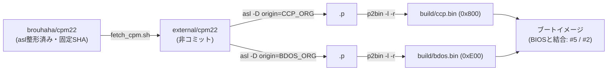

# CP/M本体 取得・ビルド・再配置設計

関連issue: #11 / 親 #3
参照: `doc/概要検討/概要検討.md`、`doc/設計/09_開発環境.md`

## 1. 目的

CP/M 2.2 本体(CCP/BDOS)を入手し、PC-8001向けの配置アドレスでビルドできるようにする。
本リポジトリには CP/M 本体ソースを含めない方針のため、**取得方法とビルド手順**を定義する。

## 2. 取得方針

- CP/M本体ソースは外部リポジトリから `external/cpm22`(gitignore 対象)へ取得する。
- 取得は `scripts/fetch_cpm.sh`(= `make fetch-cpm`)で行い、**動作確認済みコミットに固定**する。
- 本リポジトリで管理するのは PC-8001向け BIOS・ローダ・ツール・ビルド設定のみ。

### 取得元の選定

| 取得元 | 位置づけ | 採用 |
|--------|---------|------|
| http://www.cpm.z80.de/ (The Unofficial CP/M Web Site) | CP/M 2.2 オリジナルソースの一次配布元(zip)・ライセンス原典 | 参照(原典確認用) |
| https://github.com/brouhaha/cpm22 | 上記を **The Macroassembler AS (asl) 用に整形**。実機バイナリと一致検証済み(CCP/BDOSの6バイトのシリアル番号を除く) | **採用** |
| https://github.com/Z80-Retro/cpm-2.2 | ソース・マニュアル・ユーティリティ一式 | 参考 |

brouhaha/cpm22 を採用する理由: 本プロジェクトのアセンブラ(asl)で**無改変ビルド可能**であり、
配置アドレスを `-D origin=` で指定できる(再配置が容易、後述)。

- 固定コミット: `01018abbccce0bdf4874b0b2ed1a048c5fcc2987`(`scripts/fetch_cpm.sh` の `CPM_REF` 既定値)

## 3. ライセンス

CP/M 2.2 は **2022-07-07 に DRDOS, Inc.(Bryan Sparks 名義)が
「use, distribute, modify, enhance」を nonexclusive に認める許諾**を出している。
- 原典: http://www.cpm.z80.de/license.html(`external/cpm22/LICENSE.txt` にも全文あり)
- → CP/M 本体の使用・改変・再配布は可能。詳細な扱いは #14 ライセンス整理で集約する。

## 4. ビルドと再配置

### 仕組み

CP/M の各部はサイズが固定で、**配置アドレス(origin)のみ可変**:

| 部品 | サイズ | ビルド |
|------|--------|--------|
| CCP  | 0x800 (2KB)   | `asl -D origin=<CCP_ORG>` → `p2bin -l '$00' -r <範囲>` |
| BDOS | 0xE00 (3.5KB) | `asl -D origin=<BDOS_ORG>` → `p2bin -l '$00' -r <範囲>` |
| BIOS | 可変(新規作成) | #6 で設計・実装 |

`-D origin=` で配置先を与えられるため、**MOVCPM のような再配置処理は不要**。
配置アドレスを変えて再アセンブルするだけでよい。
`p2bin` の `-r` は出力レンジ(= origin 起点の固定サイズ領域)、`-l '$00'` は
未定義領域の埋め値(0x00)。**origin を変えるときは `-r` のレンジも連動して更新する**
(下記 Make 変数では `*_ORG` と `*_RANGE` をセットで変更する)。

### 取得〜ビルドのフロー

### Make ターゲット

| ターゲット | 内容 |
|-----------|------|
| `make fetch-cpm` | CP/M本体ソースを `external/cpm22` へ取得(固定コミット) |
| `make cpm` | CCP/BDOS を `CCP_ORG` / `BDOS_ORG` でビルドし `build/` へ出力 |

`CCP_ORG` / `BDOS_ORG`(および対応する `*_RANGE`)は Make 変数で上書き可能。
既定値は **44K システムの例(暫定)** で、ビルド機構の実証用。実値は #4 で確定する。
**ORG と RANGE はセットで更新する**(例: `CCP_ORG=0D800h` にするなら
`CCP_RANGE=$D800-$DFFF` も合わせて変更)。

## 5. PC-8001 での配置(#4 依存・暫定)

PC-8001 ではテキストVRAMが 0xF300〜0xFEB7 を占有するため、
**CP/Mシステム領域(CCP/BDOS/BIOS)の上端は VRAM 下端(0xF300)より下**に置く必要がある
(「3. メモリマップ設計」概要検討参照)。

配置はアドレス昇順で `… TPA → CCP → BDOS → BIOS(上端 < 0xF300)`。
BIOSサイズが未確定(#6)のため確定値は #4 で決めるが、例として BIOS 上端を 0xF2FF、
BIOS サイズを仮に 0x500 とすると:

| 部品 | 例(暫定) |
|------|-----------|
| BIOS | 0xEE00〜0xF2FF |
| BDOS | 0xE000〜0xEDFF(`BDOS_ORG=0E000h`) |
| CCP  | 0xD800〜0xDFFF(`CCP_ORG=0D800h`) |
| TPA  | 0x0100〜0xD7FF(約 54.5KB) |

> 上表は例示であり、**確定は #4(メモリマップ詳細設計)** で行う。確定後に Make 変数の既定値を更新する。

## 6. ブートイメージへの結合

ビルドした `ccp.bin` / `bdos.bin` と、新規作成する BIOS を結合してブートイメージを生成する。
結合方法・配置・ローダによる読み込みは #5(ディスクサブシステム)/ #2(ブートシーケンス)で設計する。

## 7. 検証結果

- `make fetch-cpm` → 固定コミットで取得成功。
- `make cpm` → `build/ccp.bin`(2048B=0x800)、`build/bdos.bin`(3584B=0xE00)を生成。
  CP/M 2.2 標準サイズと一致。
- `external/cpm22` 未取得時は `make cpm` が案内して停止(`check-cpm`)。
- `external/` は gitignore 対象で、CP/M本体ソースはコミットされない。
