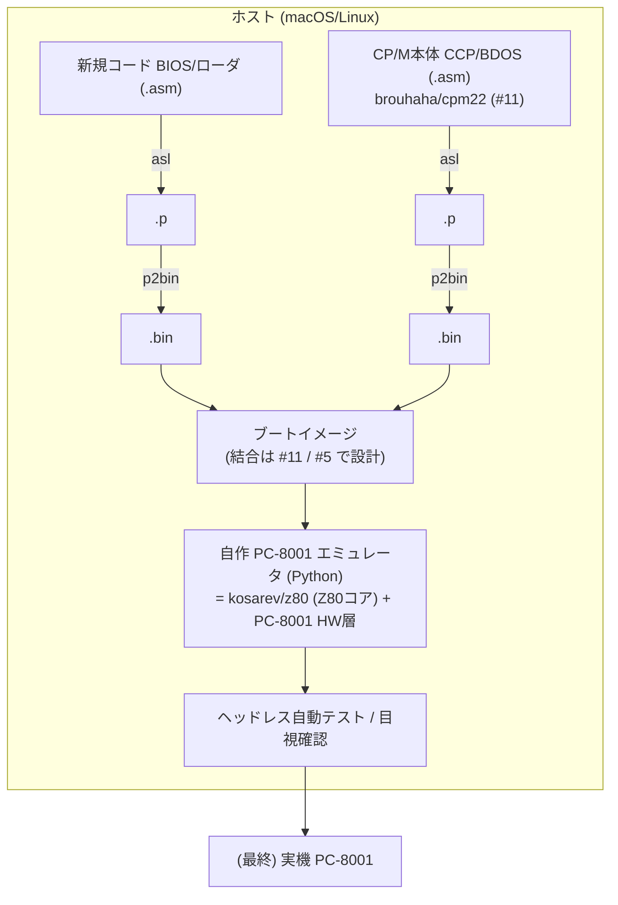

# 開発・テスト環境設計

関連issue: #12 / 親 #3
参照: `doc/概要検討/概要検討.md`

## 1. 目的

PC-8001無印向け CP/M 2.2 の開発(BIOS/ローダの新規作成、CP/M本体のビルド)と、
実機に持ち込む前のローカル検証を行うための開発・テスト環境を定義する。

## 2. ツールチェーン全体像



## 3. アセンブラ: The Macroassembler AS (asl)

- 新規コード(BIOS・ローダ等)および CP/M本体の両方を **asl** でアセンブルする
  (プロジェクト方針。CP/M本体も brouhaha/cpm22 が asl 用に整形済みのため無改変でビルド可能=#11)。
- 確認済みバージョン: `Macro Assembler AS 1.42 Beta [Bld 297]`(導入済み: `/usr/local/bin/asl`)。
- フロー: `*.asm` → **asl** → `*.p`(中間) → **p2bin**(または `p2hex`)→ `*.bin`。
- 慣例: ソース先頭で `cpu z80`、`org` で配置先を指定。CP/M本体は `asl -D origin=<addr>` で
  配置アドレスを与えられる(再配置に MOVCPM 不要)。

## 4. ディレクトリ構成

```
.
├── Makefile              開発ビルドのエントリポイント
├── scripts/
│   └── setup_env.sh      環境構築 (.venv + エミュコア取得/ビルド)
├── src/                  新規コード (今後: bios/, loader/)
├── emu/                  自作 PC-8001 エミュレータ本体 (今後・別issue)
├── tests/                テスト (smoke.asm, smoke_emu.py 等)
├── doc/                  ドキュメント (概要検討/, 設計/)
├── build/                ビルド成果物         ※gitignore
├── external/             外部取得物(エミュコア/CP/M本体) ※gitignore
└── .venv/                Python 仮想環境       ※gitignore
```

`build/` `external/` `.venv/` はコミットしない(`.gitignore` 済み)。
**自作コードは `emu/`(コミット対象)、外部取得物は `external/`(非コミット)を厳守する**
(エミュコアを `emu/` 配下に置かない)。

## 5. Python 環境

- **python3.13** を使用する。
- 注意: **python3.14 では後述の Z80 コアのビルド(setup.py)が `inspect` 周りで失敗する**ため使用しない。
- 仮想環境 `.venv` を `scripts/setup_env.sh` が python3.13 で作成する。

## 6. エミュレータ方針

PC-8001 は PC8001-MEM のバンク切替(E2/E3)や SD ボード(8255 ビットバンギング)など
独自ハードを使う。これらは MAME の pc8001 ドライバではモデル化されておらず、
ディスク/ブートの検証ができない。そこで **自作 Python エミュレータ** を主軸とする。

ただし Z80 命令セット自体は自作せず、流用可能な OSS コアを使う。

### Z80 CPU コア: kosarev/z80 (MIT)

| 項目 | 内容 |
|------|------|
| ライセンス | MIT(本プロジェクトに制約なし) |
| 完成度 | 全命令 + undocumented 対応、cputest/zexall 合格、マシンサイクル精度 |
| 実装 | C++ コア + Python 3 API |
| 取得元 | https://github.com/kosarev/z80 |
| 確認済みコミット | `a3847b55ed3e7c09d4be63c8363c96f12570dbd6`(2026-01-11)。`scripts/setup_env.sh` の `Z80_REF` 既定値で固定 |

**Python から HW をモデル化するためのコールバック API**(これが採用の決め手):

| API | 用途(PC-8001モデル化) |
|-----|----------------------|
| `set_read_callback(addr)->int` / `set_write_callback(addr,val)` | PC8001-MEM バンク切替・VRAM・RAM |
| `set_input_callback(port)->int` / `set_output_callback(port,val)` | CRTC(0x50/0x51)、表示制御(0x40)、E2/E3、SDボード(8255) |
| `set_get_int_vector_callback` / `on_handle_active_int()` / `set_reti_callback` | 割り込み(RST7 / IM2) |
| `pc/sp/af/bc...`, `set_memory_block`, `run()`, `ticks_to_stop` | レジスタ/メモリ/実行制御 |

→ Z80 命令実装は書かず、**PC-8001 ハード層(バンク/CRTC/キーボード/SDボード)を
Python のコールバックで実装するだけ**で済む(その実装は別の実装issueとする)。

### 導入方法(重要)

`pip install z80` は PEP517 のビルド分離下で setup.py が `inspect` 由来のエラーを起こすため**使わない**。
代わりに **clone して `setup.py build_ext --inplace` で直接ビルド**する(`scripts/setup_env.sh` が実施)。
ビルド済みモジュールは `external/z80` に置き、`PYTHONPATH=external/z80` で `import z80` する。

### MAME の位置づけ

今回は未使用。将来、コンソール表示の目視確認などに補助的に使う余地はあるが、
独自ハードを含む結合検証には使えない。

### Z80 I/O の注意点

`OUT (n),A` はアドレスバス上位 8bit に A が乗るため、コールバックが受け取る port は
`(A<<8)|n` になる。ポート判定は下位 8bit で行う(`port & 0xFF`)。

## 7. ビルド自動化 (Makefile)

| ターゲット | 内容 |
|-----------|------|
| `make setup` | `.venv` 作成 + Z80 エミュコア取得/ビルド(`scripts/setup_env.sh`) |
| `make smoke` | 疎通テスト: `tests/smoke.asm` を asl→p2bin→エミュレータ実行し出力を検証 |
| `make clean` | `build/` 削除 |

## 8. テスト方針

- **疎通テスト(smoke)**: `tests/smoke.asm`(1+2 を計算しポート0x10へ出力しHALT)を
  ビルドしエミュレータで実行、出力 0x03 を検証。「asl → p2bin → Z80コア → I/O確認」の
  一連が機能することを保証する(現状 `make smoke` で PASS 確認済み)。
- **今後**: BIOS ルーチン単体テスト、コンソール出力テスト、SDドライバ/ディスクI/Oテスト、
  コールド/ウォームブート結合テストを、PC-8001 エミュレータ層の実装(別issue)とともに追加する。
- ヘッドレスで自動実行できるため、CI(GitHub Actions)への組込みも可能(将来検討)。

## 9. 実機テストへの移行

ローカル(エミュレータ)で基本動作を確認後、実機 PC-8001 + PC8001-MEM + SDボードで
最終確認する。実機転送手段は #10(SD作成ツール)と連携する。

## 10. セットアップ手順

```shell
# 1. 環境構築(初回のみ。python3.13 / git / C++コンパイラが必要)
make setup

# 2. 疎通確認(setup 済みであることが前提。未実施なら make smoke が案内して停止)
make smoke      # => OK: ポート0x10へ 0x03 を出力
```

`make smoke` は `make setup` の完了(`.venv` と `external/z80`)を前提とする。
未実施の場合は `check-setup` が検出して「先に `make setup`」と案内し停止する。

## 11. ライセンス

- kosarev/z80 は MIT。`external/` に取得して使用し、本リポジトリにはソースを含めない。
- CP/M本体ソースの取得・ライセンスは #11 / #14 で扱う。
