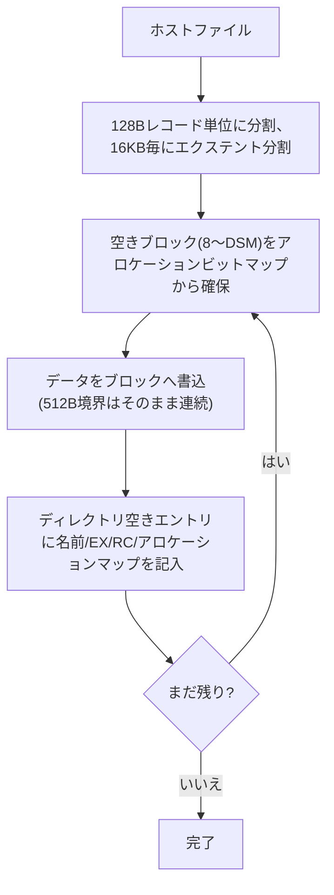

# SD作成ツール設計

関連issue: #13 / 親 #3
参照: `doc/設計/05_ディスクサブシステム.md`(ディスクレイアウト/DPB)、
`doc/設計/02_ブートシーケンス.md`(システム領域)、`doc/設計/08_CPM取得ビルド.md`(CCP/BDOS)、
`doc/設計/09_開発環境.md`(ホスト環境)

## 1. 目的

ホスト(PC)上で動作し、PC-8001 CP/M のブート用 SD(またはその生イメージ)を作成・管理する
ツールを設計する。CP/M 起動に必要なシステム領域の書き込みと、CP/M ファイルシステムへの
ファイル投入を行う。

## 2. 方針

- **生イメージ(raw)** を扱う。#8 のレイアウト(8ドライブ×4128ブロック、合計約16MB)に一致。
- 実装言語は **Python**(既存の開発環境 #9/#12 と統一。`.venv` で実行)。
- イメージファイルを作って実機SDへ書く(`dd` 等)か、SDデバイスに直接書く運用の双方を想定。
- FAT は使わない(#8 生セクタ運用)。

## 3. 取り扱うレイアウト(#8 準拠)

| 区分 | 範囲(ドライブ内, 512Bブロック) | 内容 |
|------|------------------------------|------|
| OFF(システム) | 先頭 32ブロック(=16KB, 2トラック) | ローダ/CCP/BDOS/BIOS の原本 |
| データ | 残り 4096ブロック(2MB) | CP/M ファイルシステム |
| ・ディレクトリ | データ先頭 8ブロック(=16KB) | 512エントリ(各32B) |
| ・ファイル領域 | 以降 | ブロック8〜(DSM=1023) |

- ドライブ `d`(0=A〜7=H)の先頭LBA = `d * 4128`。

## 4. 機能(サブコマンド)

| コマンド | 機能 |
|----------|------|
| `mkimage` | 空のSDイメージを作成(8ドライブ分を確保、全ドライブのディレクトリ領域を 0xE5 で初期化) |
| `sys` | システム領域(ドライブAの OFF)へ ローダ/CCP/BDOS/BIOS を配置(#5/#2 と整合) |
| `put` | ホストのファイル(`.COM` 等)を指定ドライブの CP/M ファイルとして書き込み |
| `dir` | 指定ドライブの CP/M ディレクトリを一覧 |
| `get` | CP/M ファイルをホストへ取り出し(任意) |
| `format` | 指定ドライブのみ初期化(ディレクトリ領域を 0xE5 に。OFF/データ本体や他ドライブは触らない) |

> 初期化は **ディレクトリ領域(データ先頭16KB=8×2KBブロック)を 0xE5 で埋めれば十分**
> (CP/M は空きエントリをオフセット0=0xE5 で判定)。`format` は対象ドライブの OFF(システム)を
> 消さない。`mkimage` はイメージ全体を確保しつつ各ドライブのディレクトリのみ初期化する。

## 5. CP/M ファイルシステム書き込み

### ディレクトリエントリ(32バイト, #8 DPB準拠)

| オフセット | 内容 |
|-----------|------|
| 0 | ユーザ番号(0x00〜0x0F、空き=0xE5) |
| 1〜8 | ファイル名(8、スペース埋め、各文字の b7 は属性。名前は7bit ASCIIに正規化し b7=0) |
| 9〜11 | 拡張子(3、同上。b7 は R/O・SYS・Archive 属性) |
| 12 (EX) | 論理エクステント番号の下位5bit(0〜31) |
| 13 (S1) | 未使用(0) |
| 14 (S2) | 論理エクステント番号 >> 5(本設計では0〜3) |
| 15 (RC) | このエクステントの128Bレコード数。満杯=128(0x80)、最終エクステントのみ端数(1〜128) |
| 16〜31 | アロケーションマップ(ブロック番号) |

- **エクステント番号**: `extent_no = (S2 << 5) | (EX & 0x1F)`。EX は 0〜31 でラップし、
  **32エクステント(=512KB)ごとに S2 が +1** される。`put` は EX の桁上げを必ず実装する
  (本設計は1ドライブ最大 2MB/16KB = 128エクステント → EX=0〜31, S2=0〜3)。
  `dir`/`get` 読取時は **`EX & 0x1F`、`S2 & 0x3F` でマスク**する。
- **アロケーションマップ**: 本DPBは DSM=1023 (>255) のためブロック番号は **16bit**。
  16バイトを **8個の16bitブロック番号(リトルエンディアン)** として扱う
  (DSM≤255 の 8bit×16 とは異なる)。満杯エクステントは8スロット全部(8ブロック×2KB=16KB)、
  端数は前詰めで使用し残りは0。RC と整合させる。
- 1エクステント = 8ブロック × 2KB = **16KB**(EXM=0 → 1ディレクトリエントリ=1論理エクステント)。
  16KB超のファイルは EX(必要なら S2 へ桁上げ)を増やした複数ディレクトリエントリで表現する。

### 書き込みアルゴリズム(`put`)

- 空きブロック管理: ディレクトリを走査して使用済みブロックを集計 → **ブロック8から昇順**に未使用を割当
  (ブロック0〜7 はディレクトリ予約 AL0=0xFF/AL1=0x00 に対応し、ファイルには使わない。
  実機CP/Mのビットマップ割当と一貫させ再現性を確保)。
- `dir`/`get` は同一ファイル(name,ext,user)の複数エクステントを extent_no 昇順に連結する。
- ファイル名正規化: 小文字→大文字、7bit ASCII に制限し各文字の b7=0(b7は属性ビットのため)。
  CP/M で禁止の文字(`< > . , ; : = ? * [ ]`)は除外、8.3超過は切り詰め/エラー(方針は実装時)。

## 6. システム領域の書き込み(`sys`)

- `make cpm`(#11)で生成した `ccp.bin`(0x800)/`bdos.bin`(0xE00)、新規作成の `bios.bin`、
  および `loader.bin`(#5)を、ドライブAの OFF 領域(先頭32ブロック)に**所定オフセットで**配置する。
- 配置順・オフセットは #5(ブート)/#2 のシステムイメージ仕様、および #10(WBOOT再ロード元=OFF領域,
  #10設計)と一致させる。具体オフセット表はブート実装時に確定し、本ツールと共有する。

## 7. 実機SDへの書き込み

- 生成した raw イメージを `dd`(macOS/Linux)等で SD に書く。
- もしくはツールが SD デバイスへ直接書く(要管理者権限・デバイス指定の安全確認)。
- イメージはSD先頭から約16MBを使う。SDの残り領域は未使用(#8/#9)。

## 8. テスト方針(#12連携)

- ツールで作成したイメージを **自作Pythonエミュレータ(SDカードモデル, #9/#8)に渡し**、
  CP/M が起動し `DIR` でファイルが見える/読めることを確認(往復テスト)。
- `put`→エミュで読取→内容一致、`dir` の表示一致、複数エクステント(>16KB)ファイルの検証。
- 既存CP/Mツール(あれば)との相互運用は任意。

## 9. 申し送り

| 項目 | 後続/整合 |
|------|----------|
| システム領域の配置オフセット表 | #5/#2/#10 と共有・確定 |
| BIOS バイナリ(`bios.bin`) | #6 実装で生成 |
| 直接SD書き込みの安全確認(デバイス指定) | 実装時 |
| ツールの配置(`scripts/` or `tools/`)・CLI仕様 | 実装時 |
